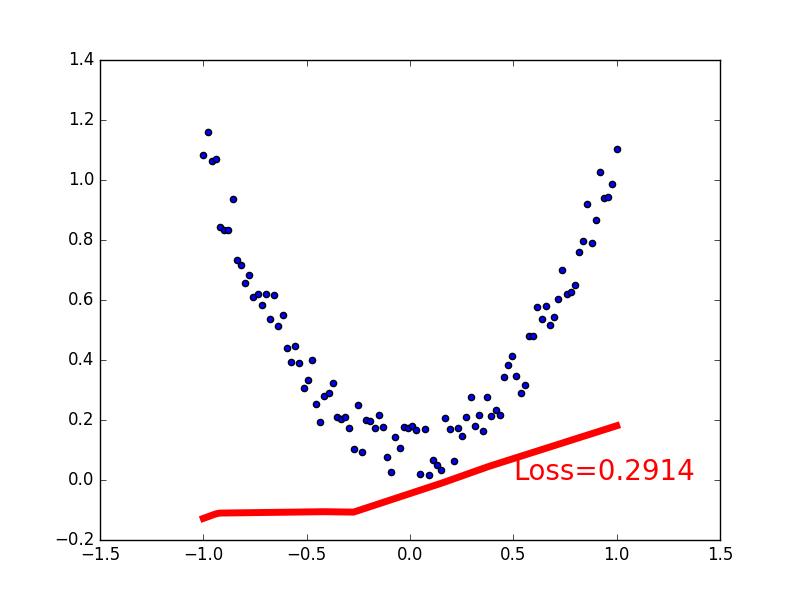
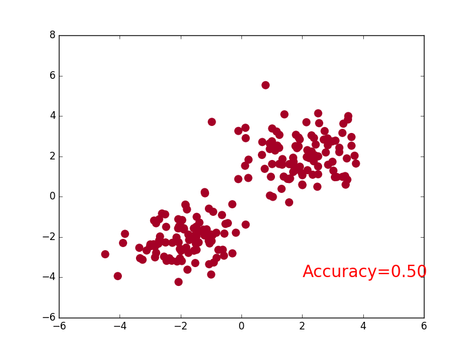

# 說明報告
## Regression
### 建立網路
- relu函數的特點是小於0的輸入，輸出全為0
    ```py
    # 來自[1]
    class Net(torch.nn.Module):
        def __init__(self, n_feature, n_hidden, n_output):
            super(Net, self).__init__()  # 繼承__init__功能
            # 定義隱藏層與輸出層的形狀
            self.hidden = torch.nn.Linear(n_feature, n_hidden)
            self.predict = torch.nn.Linear(n_hidden, n_output)

        def forward(self, x):  # 正向傳遞
            x = F.relu(self.hidden(x))  # 激勵函數 
            x = self.predict(x)  # 輸出值
            return x
    ```
### 訓練
- 隨機梯度下降比起正常梯度下降來的快，因為正常梯度下降是將所有樣本計算完之後才更新參數，而隨機梯度下降是抽取一部份樣本計算就更新參數 
- 均方差是計算兩者誤差平方的平均，平方會使偏離更多的值受到更嚴厲的懲罰 
    ```py
    # 來自[1]
    optimizer = torch.optim.SGD(net.parameters(), lr=0.2)  # SGD是隨機梯度下降
    loss_func = torch.nn.MSELoss()  # MSE是均方差
    for t in range(200):
        prediction = net(x)
        loss = loss_func(prediction, y)  # 計算損失
        optimizer.zero_grad()  # 清空當前梯度快取，否則之前的梯度會累加到當前的梯度
        loss.backward()  # 反向傳遞
        optimizer.step()  # 更新參數
    ```
### 視覺化
 [1]

## Classification
### 建立網路
- relu函數的特點是小於0的輸入，輸出全為0 
    ```py
    # 來自[1]
    class Net(torch.nn.Module):
        def __init__(self, n_feature, n_hidden, n_output):  # n_output決定分類的類別數
            super(Net, self).__init__()
            self.hidden = torch.nn.Linear(n_feature, n_hidden)
            self.out = torch.nn.Linear(n_hidden, n_output)

        def forward(self, x):
            x = F.relu(self.hidden(x)) 
            x = self.out(x)
            return x
    ```
### 訓練
- LogSoftmax就是將Softmax完的輸出再取Log，Softmax會將輸入樣本變成機率分布，取完Log之後會變成負的，而機率越小的輸出就會顯著的變小 
- NLLLoss就是將輸入對應的那个值拿出来，再去掉負號，再求均值。 
    ```py
    # 來自[1]
    optimizer = torch.optim.SGD(net.parameters(), lr=0.02)
    loss_func = torch.nn.CrossEntropyLoss()  # CrossEntropyLoss是LogSoftmax+NLLLoss，

    for t in range(100):
        out = net(x)
        loss = loss_func(out, y)

        optimizer.zero_grad()
        loss.backward()
        optimizer.step()
    ```
### 視覺化
 [1]

---
- 參考資料
    - [1] [莫煩Python](https://morvanzhou.github.io/tutorials/machine-learning/torch/)
    - [2] [機器/深度學習-基礎數學(三):梯度最佳解相關算法](https://medium.com/@chih.sheng.huang821/%E6%A9%9F%E5%99%A8%E5%AD%B8%E7%BF%92-%E5%9F%BA%E7%A4%8E%E6%95%B8%E5%AD%B8-%E4%B8%89-%E6%A2%AF%E5%BA%A6%E6%9C%80%E4%BD%B3%E8%A7%A3%E7%9B%B8%E9%97%9C%E7%AE%97%E6%B3%95-gradient-descent-optimization-algorithms-b61ed1478bd7)
    - [3] [Softmax v.s. LogSoftmax - 吳政龍 - Medium](https://medium.com/@ZhengLungWu/softmax-v-s-logsoftmax-7ce2323d32d3)
    - [4] [均方誤差 - 維基百科，自由的百科全書](https://zh.wikipedia.org/wiki/%E5%9D%87%E6%96%B9%E8%AF%AF%E5%B7%AE)
    - [5] [Pytorch详解NLLLoss和CrossEntropyLoss_豪哥的博客-CSDN博客](https://blog.csdn.net/qq_22210253/article/details/85229988)